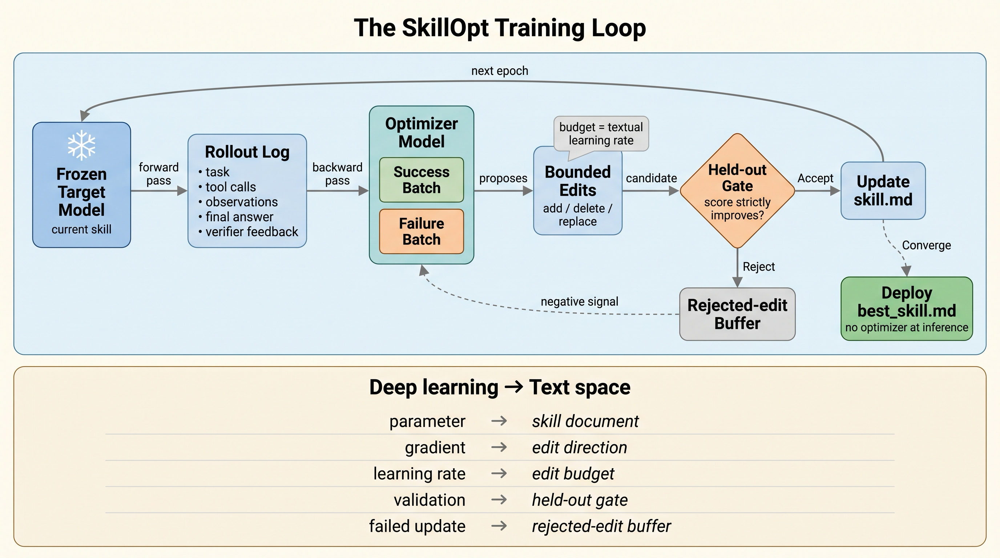
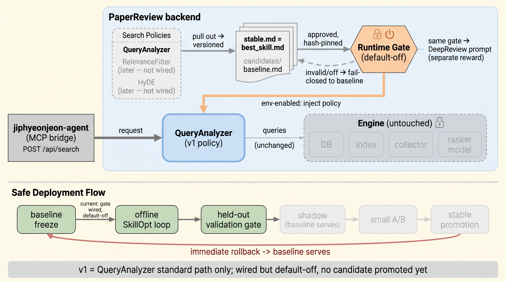

# 집현전 검색 고도화를 에이전트에게 넘겼다

지난 글들에서 나는 집현전이 내놓은 리서치를 그래프로 남기고, 리서치의 시작을 자율 에이전트에게 넘기고, 쓰는 에이전트와 검사하는 에이전트를 갈라놓는 이야기를 했다. 이번엔 한 겹 더 안쪽을 건드렸다 — 에이전트가 논문을 검색할 때 읽는 정책 자체를, 사람 감이 아니라 검증 절차가 고치게 만들었다. 그리고 그 장치를 실제로 집현전에 심었다.

## 왜 검색 정책을 손대는가

집현전 검색의 품질을 실제로 가르는 건 모델이 아니라, 에이전트가 읽는 몇 장의 자연어 정책이다. 쿼리 의도를 어떻게 읽을지(QueryAnalyzer), 검색을 어떻게 넓힐지(HyDE), 어떤 논문이 관련 있는지 어떻게 채점할지(RelevanceFilter) — 전부 프롬프트에 적힌 텍스트다. 그동안 나는 이걸 감으로 고쳐 왔다. 한 줄 바꾸면 어떤 검색은 좋아지고 다른 검색은 조용히 나빠지는데, 개선인지 퇴행인지 가릴 기준도, 되돌릴 장치도 없었다.

게다가 검색은 혼자 쓰이지 않는다. 검색이 넘긴 논문을 딥리뷰·관련논문 탐색·북마크·커리큘럼·그림·블로그 초안이 그대로 받아 쓴다. 정책 한 줄을 잘못 건드리면 그 여파는 검색 결과창이 아니라 이 여덟 에이전트 전부에 번진다. 그러니 손 가는 대로 고칠 수는 없었다.

## SkillOpt: 스킬 문서를 '훈련'한다

그래서 Microsoft의 SkillOpt를 빌려왔다. 발상은 한 줄이다 — 에이전트가 읽는 스킬 문서를 모델 가중치처럼 훈련하는 것이다. 절차는 이렇게 돈다.

1. 지금 스킬로 실제 문제를 여러 번 풀게 하고, 그 과정(도구 호출·관찰·최종 답·채점)을 rollout으로 남긴다.
2. 옵티마이저 모델이 실패한 rollout과 성공한 rollout을 갈라 읽고, 실패에서 공통으로 고칠 점을 뽑아 편집을 제안한다. 단, 한 번에 고치는 양엔 상한을 둔다(딥러닝의 learning rate에 해당).
3. 편집한 후보 스킬은 따로 떼어 둔 검증셋에서 점수가 '확실히' 나아질 때만 채택한다.
4. 떨어진 편집은 버리지 않고 버퍼에 모아, 다음 라운드에 '이건 하지 마라'는 신호로 쓴다.
5. 수렴하면 군더더기 없는 스킬 파일(best_skill.md) 하나가 남는다. 배포 뒤엔 옵티마이저를 다시 부를 필요가 없다.

관문이 핵심이다. 검증셋을 통과한 편집만 남기기 때문에, 그럴듯하지만 틀린 자기수정(self-refine)과 갈린다. 논문은 여러 모델·벤치마크에서 좋은 성적을 내놨지만, 그건 전부 저자들이 낸 숫자고 독립 재현은 아직 없다. 내가 빌린 건 숫자가 아니라 이 방법이다.

*고쳐 보고 → 검증셋 관문을 통과한 편집만 반영 → 떨어진 건 서랍에 남겨 다음 라운드의 반면교사로. 수렴하면 스킬 파일 하나가 남는다.*

## 집현전에 어떻게 심었나

핵심 원칙부터. 검색 엔진 자체 — DB·인덱스·수집기·랭커 모델 — 는 건드리지 않는다. 손대는 건 오직 검색용 정책 문서다. 그래서 QueryAnalyzer 같은 정책을 코드에서 떼어 내 버전이 붙은 스킬 아티팩트로 분리했다: 현재 정책을 고정한 `baseline`, SkillOpt가 만든 `candidates`, 프로덕션에 물린 `stable`. 정책을 바꾸거나 되돌리는 일이 코드 수정이 아니라 파일 교체로 끝난다.

이걸 실제로 집현전 백엔드에 병합하고, 라이브 검색의 쿼리 분석 단계에 훅으로 연결했다. 첫 버전의 범위는 일부러 좁혔다 — QueryAnalyzer 한 경로만. HyDE와 RelevanceFilter는 뒤로 뺐다.

안전장치는 정책 위가 아니라 정책을 켜는 '문'에 걸었다. 기본은 off다. 승인 관문을 통과한, 해시로 고정된 정책을 내가 env로 명시해 켤 때만 주입되고, 파일이 없거나 해시가 어긋나면 조용히 baseline으로 닫힌다(fail-closed). baseline과 후보가 서로의 캐시를 재사용하지 못하게 캐시 키도 갈라 뒀다. 같은 안전 모델을 딥리뷰 분석 프롬프트에도 그대로 확장했다 — 단 딥리뷰의 보상은 nDCG가 아니라 근거 충실도·방법론 커버리지 같은 리뷰 품질 기준이다.

무엇을 켤지는 오프라인에서 먼저 판가름 난다. baseline을 고정하고, 오프라인에서 SkillOpt를 돌리고, 따로 떼어 둔 검증 관문에 거르고, shadow로 지켜보고(실사용엔 baseline이 응답), 소규모 A/B로 조금 흘려 본다 — 통과하면 승격, 어긋나면 즉시 롤백. 프로덕션 트래픽은 이 관문을 다 통과하기 전엔 후보를 보지 않는다.

*위: 검색 정책만 버전이 붙은 파일로 떼어 내고, 검색 엔진은 그대로 둔다. 아래: baseline 고정 → 오프라인에서 훈련하고 검증 관문에 거른 뒤 → 그림자로 지켜보고 → 작게 실험하고 → 켜거나, 곧바로 되돌리거나.*

— 이 글에 나온 방법: SkillOpt(arXiv:2605.23904), 그리고 같은 계보의 TextGrad·GEPA. 인용한 성능 수치는 전부 저자보고다.

#LLM #AgenticAI #SkillOpt #AgentSkills #PaperSearch #Jiphyeonjeon
